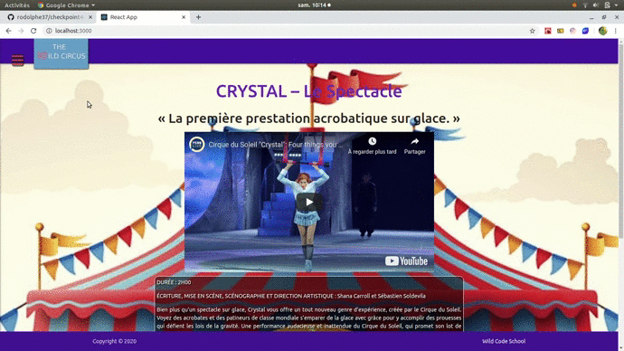
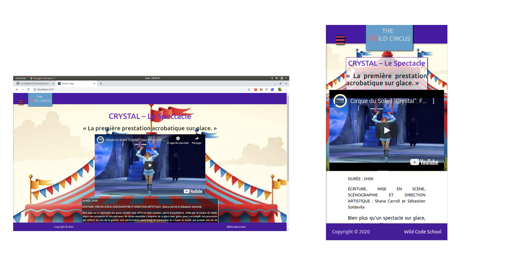

### checkpoint 4 

## Janvier 2020

# The Wild Circus 

**(FrontEnd => React (Hooks) and Redux) (BackEnd => Express and MySQL)**


[Demo](#demo)

-  [Movie](#movie-demo)
-  [Pictures](#pictures-demo)


[Author](#author)

[License](#license)

[Start Project](#Start-project)

---
## Demo
---
### Movie Demo



---
### pictures Demo




---
 

## Tech Stack

 **You must have at minimun these versions for greats performances and good compatibility**

 **Version of Node js**
-    v8.16.2 minimun

---  

## Author 

- Rodolphe Augusto 

--- 

## License  

- MIT.

---

## Start project

### Warning ! 
***this application React works with a Backend***
[Backend for this app](api folder,  start on port 8000)
---

- Clone or download this repo https://github.com/rodolphe37/checkpoint4-circus.git

- Restore Database with ``` dump-circus-202001310919.sql ```


- Create dotenv file  on your app's root (in the api folder) and name it ".env" : 
- put it in this file :
  
``` DB_USER=YourDbUser, DB_NAME=circus, DB_HOST=localhost , DB_PASSWORD=(YourDbPassword) ```
 

 Do in the console :
 
-  ``` $ cd api```

-  ```  $ npm i``` or ``` $ npm install ```

to install the dependencies and

-  ``` $ npm run dev```

to start backEnd project.

--- 

 after that Do in the console :

-  ``` $ cd .. ``` 

to return to the parent folder, and do

-  ``` $ cd client```

to going to our frontend folder, then doing:

-  ```  $ npm i``` or ``` $ npm install ```

to install the dependencies and

-  ``` $ npm start```

to start  frontEnd project.

  

enjoy!!!
